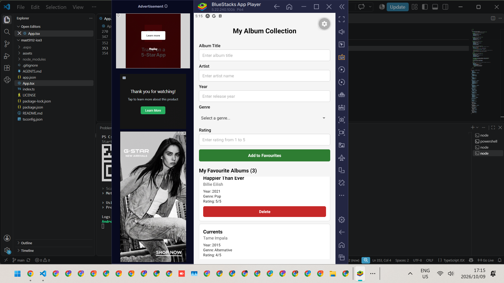

# ICE Task 3: Album Collection and Debugging

**Name:** Kgopotso Thupi
**Student number:** ST10530092
**Module:** MAST5112 (Mobile Application Scripting)
**Repository:** https://github.com/ST10530092/mast5112-ice3

---

## 1. Introduction

The Album Collection app lets a user build a list of favourite albums. The user enters an album title, artist, release year, genre and rating, and the app validates the input before adding the album to a collection. The collection is held in React state and displayed with a `FlatList`. Each album can be removed with a Delete button.

The supplied `App.tsx` contained intentional errors in its types, validation, state handling, `Picker`, `FlatList` and delete logic. In this task I examined the code, identified each error, corrected it, and tested the corrected application. I did not redesign the app, and all of the code remains in `App.tsx`.

---

## 2. Development Environment

| Item | Details |
|------|---------|
| Framework | Expo (SDK 57) |
| Library | React Native |
| Language | TypeScript |
| Project template | `expo-template-blank-typescript` |
| Editor | Visual Studio Code |
| Machine | Personal Windows PC |
| Emulator | BlueStacks 5 |
| Test app | Expo Go (running inside BlueStacks 5) |
| Extra package | `@react-native-picker/picker` |

**Note on the environment:** the brief asks for the task to be completed in the institutional VM. BlueStacks 5 would not start in the VM because it failed with a "failed to initialise graphics backend for OpenGL" error, so I completed and tested the task on my own Windows PC instead, using the same tools (BlueStacks 5 with Expo Go).

The project was created with `npx create-expo-app@latest ice3 --template blank-typescript`. Dependencies were installed with `npm install --legacy-peer-deps`, because `@expo/ui` and `react-dom` have a peer dependency conflict that stops a plain `npm install`. The `Picker` package was installed with `npx expo install @react-native-picker/picker -- --legacy-peer-deps` (see error 11). The app was started with `npx expo start` and opened in Expo Go by connecting BlueStacks over ADB and entering the `exp://` URL manually, following the workflow from ICE Task 1.

---

## 3. Error Log

| # | Location | Problem | Error Type | Correction |
|---|----------|---------|------------|------------|
| 1 | `Album` type and `handleSave` | `year` and `rating` were declared as `string` in the `Album` type, but `handleSave` assigned `Number(year)` and `Number(rating)`. The object did not match its declared type, so TypeScript reported a type mismatch. | TypeScript | Changed `year` and `rating` to `number` in the `Album` type so the type matches the values stored. |
| 2 | `validateForm`, title length check | The condition joined "shorter than the minimum" and "longer than the maximum" with the logical AND operator. A title cannot be both too short and too long at once, so the condition was never true and invalid lengths were accepted. | Logic / Validation | Replaced the AND operator with the logical OR operator so a title that is too short or too long is rejected. |
| 3 | `validateForm`, artist length check | The same AND mistake as the title check, so artist names of an invalid length were accepted. | Logic / Validation | Replaced the AND operator with the logical OR operator. |
| 4 | `validateForm`, year check | Only the minimum year was checked, although the message said the year must be between 1900 and the current year. Future years such as 3000 were accepted. | Logic / Validation | Added `numericYear > currentYear` to the condition using the OR operator. |
| 5 | `validateForm`, rating check | Only the minimum rating (1) was checked. The constant `MAX_RATING` was defined but never used, so ratings such as 99 were accepted. | Logic / Validation | Added `numericRating > MAX_RATING` to the condition using the OR operator. |
| 6 | `handleSave`, `setAlbums` | `setAlbums([temporaryAlbum])` replaced the whole array with a single album, so each new album erased all previously added albums. | State / Logic | Changed to `setAlbums((currentAlbums) => [...currentAlbums, temporaryAlbum])` so existing albums are kept and the new one is appended. |
| 7 | `handleDelete` | `filter` used `album.id === id`, which keeps only the album that was selected and removes all the others, the opposite of the intended behaviour. | Logic | Changed the comparison to `album.id !== id` so every album except the selected one is kept. |
| 8 | Genre `Picker`, `selectedValue` | `selectedValue` was bound to the `title` state instead of `genre`, so the Picker did not display the genre the user chose. | State / Runtime | Changed `selectedValue` to `genre`. |
| 9 | Genre `Picker.Item` | Every item had `value={genre}`, so all options carried the same value (the current state) instead of their own, and selecting a genre did not store the correct one. | Logic / Runtime | Changed to `value={item}` so each option carries its own genre. |
| 10 | `FlatList`, `keyExtractor` | `keyExtractor` returned `item.title`. Titles are not unique, so two albums with the same title produced duplicate keys, which causes warnings and rendering problems. | Runtime | Changed to `item.id`, which is unique for each album (created with `Date.now().toString()`). |
| 11 | Picker import | The `@expo/ui` Picker did not work in Expo Go on BlueStacks. The Genre box showed empty, the app logged "Encountered two children with the same key", and a genre could not be selected, so validation kept reporting "Please select a genre". | Runtime / Compatibility | Installed `@react-native-picker/picker` with `npx expo install` and imported `Picker` from it. Added a `string` type to the `onValueChange` parameter so TypeScript no longer reports an implicit `any`. |

---

## 4. Testing

I tested the corrected application in the BlueStacks 5 emulator using Expo Go. I retested after each correction until all of the scenarios below behaved as expected.

| Test | What I did | Expected result | Result |
|------|-----------|-----------------|--------|
| 1. Initial application | Launched the app | Interface displays with no errors | Passed |
| 2. Invalid input | Submitted an empty form, a one-character title, a year of 3000 and a rating of 99 | Validation message appears and nothing is added | Passed |
| 3. Valid album | Entered a full valid album (Happier Than Ever, Billie Eilish, 2021, Pop, 5) and pressed Add to Favourites | Album appears in the list with correct details | Passed |
| 4. Multiple albums | Added three different albums | All three remain in the list with correct details | Passed |
| 5. Delete | Deleted the middle album from a list of three | Only the selected album is removed, the others remain | Passed |
| 6. Repeat | Added and deleted more albums | App stays stable and the counter updates correctly | Passed |

Before the Picker fix, the Genre box showed empty and the app reported "Please select a genre" even after a genre had been chosen. After the fix, the chosen genre is stored and displayed on the album card.

---

## 5. Screenshot

The screenshot below shows the completed Album Collection application running in the BlueStacks 5 emulator with Expo Go.

---

## 6. Conclusion

This task taught me that a program can compile and still behave incorrectly, so running and testing the app is just as important as reading the code. Several of the faults were small logic mistakes, such as using AND instead of OR, `===` instead of `!==`, or overwriting an array instead of appending to it. These only showed up when I interacted with the app. I also learned the value of matching TypeScript types to the data actually stored, using unique ids for `FlatList` keys, and updating React state with the previous state so existing data is not lost. The Picker problem showed me that a library can work in theory but fail in a specific environment, and that checking the error messages and swapping to a compatible package is part of debugging. Keeping an error log as I worked made it easier to explain what was wrong, why it was wrong, and how I fixed it.
